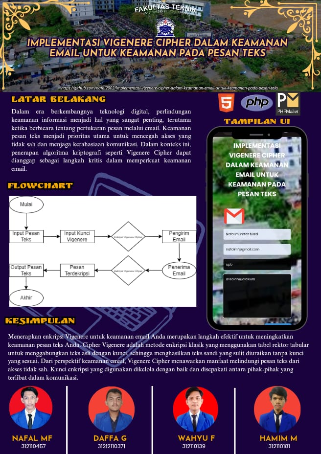

# Implementasi Vigenere Cipher dalam Keamanan Email untuk Keamanan Pada Pesan Teks

## Deskripsi

Implementasi Vigenere Cipher dalam Keamanan Email untuk Keamanan Pada Pesan Teks adalah sebuah program yang menghasilkan kode enkripsi menggunakan Vigenere Cipher untuk melindungi keamanan email.

## Instalasi

Clone atau download repository ini.
Buka terminal dan navigasikan ke direktori repository.
Jalankan perintah python3 vigenere_cipher.py untuk menjalankan program.

## Penggunaan
Program akan meminta Anda memasukkan teks plain dan kunci. Setelah itu, program akan menghasilkan teks cipher yang dapat digunakan sebagai enkripsi untuk pesan email. Untuk dekripsi, gunakan kunci yang sama dan masukkan teks cipher untuk mendapatkan teks plain asli.
## Contoh

## Kesimpulan

Kesimpulan singkat tentang proyek ini.

## Developed by

Informasi tentang pengembang proyek ini.
